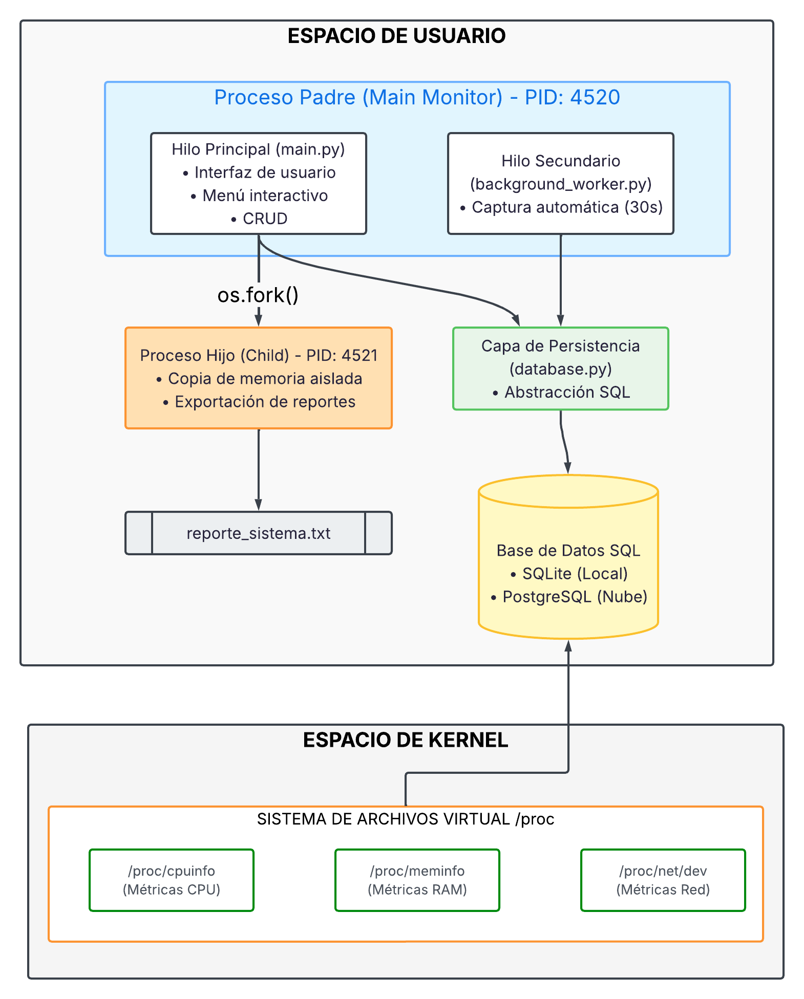
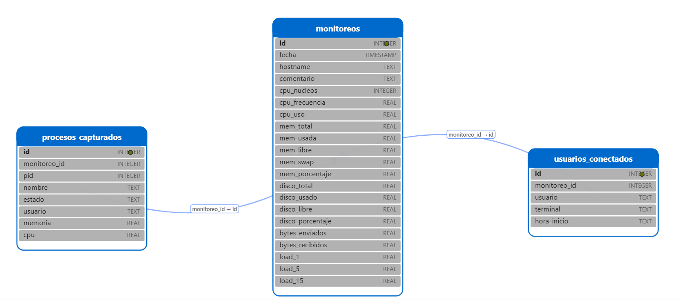

# Mini Monitor de Recursos para Linux - Proyecto Integrador de SO

## Descripción del Proyecto
Este proyecto consiste en un **Mini Monitor de Recursos para sistemas operativos Linux**, desarrollado completamente en **Python**. Su objetivo principal es aplicar los conceptos fundamentales de Sistemas Operativos, tales como la lectura de archivos del sistema, el manejo de procesos (fork), la ejecución concurrente mediante hilos (threading) y la persistencia de datos a través de operaciones CRUD.

A lo largo del desarrollo, se llevaron a cabo una serie de actividades estructuradas para cumplir con los requerimientos de la materia.

## Arquitectura y Tecnologías Utilizadas
* **Lenguaje:** Python 3
* **Persistencia:** SQLite (Motor de base de datos integrado)
* **Entorno de Desarrollo:** Visual Studio Code (VSC) en Linux
* **Control de Versiones:** Git y GitHub
* **Lectura de hardware:** Análisis directo del sistema de archivos virtual (`/proc/cpuinfo`, `/proc/stat`, `/proc/meminfo`) y llamadas al sistema (`subprocess`).

### Diagrama de Arquitectura


## Actividades Realizadas

Durante el ciclo de desarrollo del proyecto, se ejecutaron las siguientes fases de implementación:

### 1. Planificación, Arquitectura y Base de Datos
* Se configuró el entorno colaborativo utilizando un repositorio en GitHub.
* Se definió la estructura modular del proyecto, separando las responsabilidades de CPU, RAM, Sistema y Base de datos.
* Se implementó una base de datos local utilizando **SQLite** (`monitor.db`), diseñando tablas para registrar el historial de monitoreos, procesos capturados y usuarios conectados.

#### Diagrama Entidad-Relación


### 2. Lectura de CPU y RAM desde `/proc`
* Se desarrolló el módulo `monitor_cpu.py` para analizar directamente `/proc/cpuinfo` (obteniendo el modelo, núcleos y frecuencia del procesador) y `/proc/stat` (calculando el porcentaje de uso de CPU en tiempo real).
* Se creó el módulo `monitor_ram.py` para extraer y transformar los datos de memoria desde `/proc/meminfo`, convirtiendo los valores dinámicos a Gigabytes (GB) y calculando el uso de memoria RAM y Swap.

### 3. Captura de Métricas de Sistema, Usuarios y Procesos
* En el módulo `monitor_sistema.py`, se implementó la lectura de almacenamiento utilizando el comando `df -h` mediante la librería `subprocess`.
* Se incluyó la funcionalidad para listar los usuarios conectados (`who`) y extraer el estado de los procesos que consumen más recursos utilizando el comando `ps`.

### 4. Concurrencia (Hilos y Fork) e Implementación CRUD
* **Hilos (Threading):** Se implementó un hilo en segundo plano (`background_logger`) que registra automáticamente la telemetría del sistema en la base de datos cada 30 segundos, permitiendo que la interfaz principal siga interactuando con el usuario sin interrupciones.
* **Procesos (Fork):** Se aplicó el concepto de duplicación de procesos con `os.fork()`. Esta técnica fue utilizada para exportar los reportes históricos a un archivo de texto; de este modo, el proceso hijo gestiona la escritura intensiva en disco mientras el proceso padre mantiene la disponibilidad y funcionalidad del menú principal.
* Se completaron las operaciones **CRUD** en `database.py` (Crear, Leer, Actualizar y Eliminar), brindando administración completa sobre el historial de capturas.

### 5. Integración, Pruebas y Entregables
* Todos los módulos fueron integrados en un único archivo ejecutable `main.py`, que presenta un menú interactivo por consola (CLI).
* Se redactó el artículo científico (Paper) siguiendo el formato IEEE en LaTeX (Overleaf), documentando la metodología aplicada y los resultados del proyecto.
* Se elaboró un video demostrativo explicando el código fuente y mostrando la correcta ejecución de hilos, procesos y el CRUD de la aplicación.
* Se consolidó la presentación de diapositivas final para la defensa técnica del proyecto.

## Estructura del Código

* `main.py`: Punto de entrada de la aplicación y gestor del menú interactivo.
* `database.py`: Creación de esquemas y métodos de persistencia (CRUD).
* `monitor_cpu.py`: Lógica para la extracción de datos de la CPU.
* `monitor_ram.py`: Lógica para la extracción de datos de la memoria.
* `monitor_sistema.py`: Interfaz con los comandos del sistema operativo (disco, usuarios, procesos).

## Cómo Ejecutar el Proyecto

Para iniciar la herramienta de monitoreo, asegúrese de estar en un entorno Linux, clone el repositorio y ejecute el archivo principal:

```bash
python3 main.py
```
